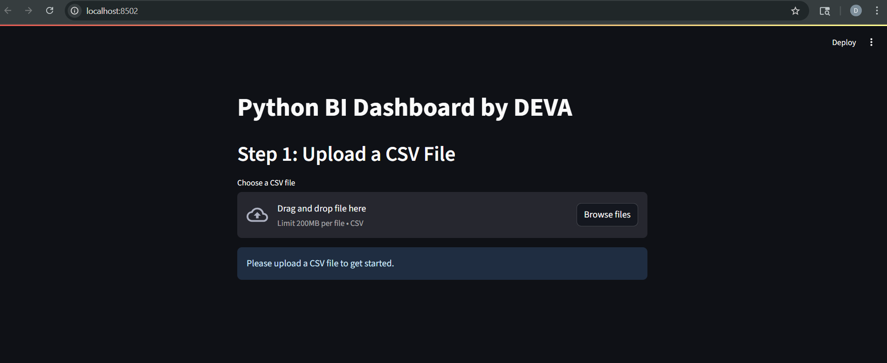
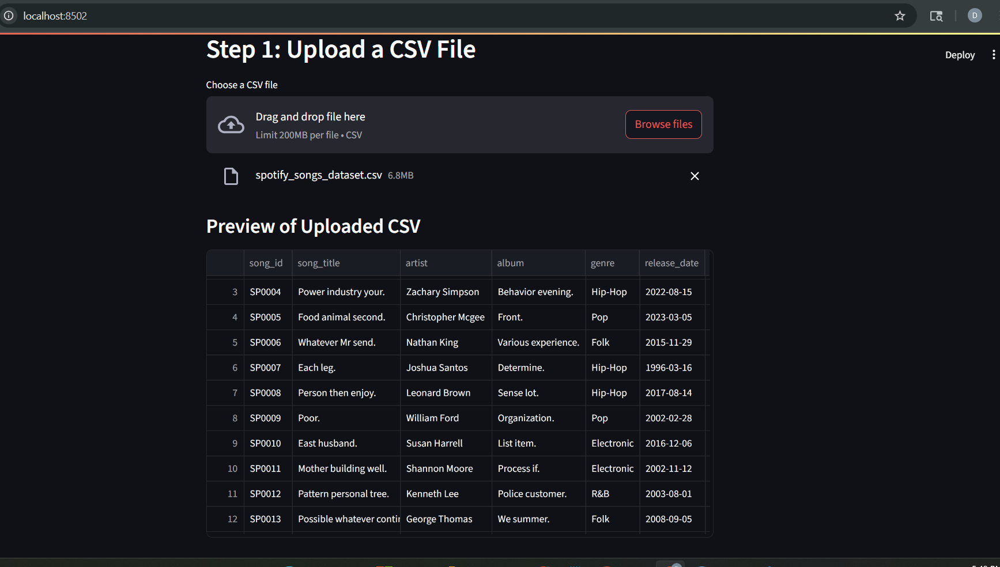
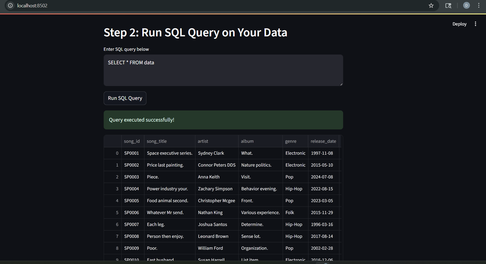
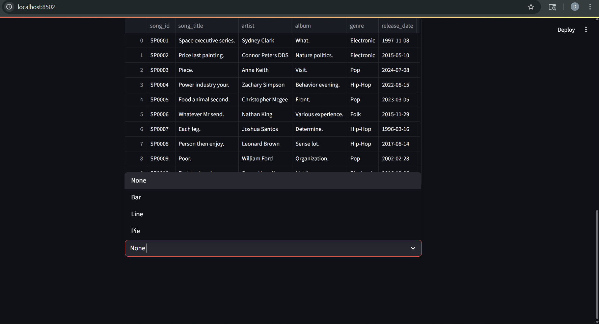

# Python BI Dashboard (Exploration Project)

This project is a simple **Streamlit-based BI Dashboard** created as part of exploring my Python coding skills.  
The dashboard allows users to:  

1. Upload a CSV file  
2. Store the data in an **in-memory SQLite database**  
3. Run **custom SQL queries** against the data  
4. Optionally visualize the query results using **Plotly Express** (Bar, Line, Pie charts)  

---

## 🚀 Features
- Upload any CSV file and preview its contents.  
- Query your CSV data using standard SQL syntax.  
- Interactive table output for SQL results.  
- Visualization options: Bar, Line, Pie.  

---

## 🛠️ Tech Stack
- **Python**  
- **Streamlit** – for web app UI  
- **SQLite (in-memory)** – for SQL queries  
- **Pandas** – for data manipulation  
- **Plotly Express** – for visualization  

---

## ⚡ How to Run
1. Clone this repository.  
2. Install dependencies:  
   ```bash
   pip install streamlit pandas plotly


(SQLite comes built into Python).

3. Run the app:

   ```bash
   streamlit run csv_dashboard.py
   ```

4. Open the Streamlit app in your browser, upload a CSV file, and start exploring!

---

## 📸 Screenshots

Add your own screenshots here to demonstrate the dashboard:

* **App Home Page**
  .

* **CSV Upload Example**
  

* **SQL Query Result**
  

* **Visualization (Bar Chart Example)**
  

*(Make sure to place your screenshots inside a `screenshots/` folder in this repo.)*

---

## ⚠️ Known Issue: Chart Not Rendering

During testing, the **Plotly visualization** sometimes does not display in the Streamlit app.

### Possible Causes:

* **Data type mismatch**: Plotly requires numeric columns for `y-axis` in Bar/Line, and numeric values in Pie.
* **Empty SQL query result**: No chart is generated.
* **Streamlit rendering issue**: Rare cases where `st.plotly_chart` does not display.

### Fixes Tried:

1. Reinstalled Plotly (`pip uninstall plotly -y` → `pip install plotly`).
2. Added `use_container_width=True` to improve rendering.
3. Debugged by printing `df.dtypes` to check column data types.
4. Tried automatic conversion of numeric-looking strings to numbers.

Despite these fixes, the visualization still did not render consistently on some datasets.
Since this project is for **learning/exploration only**, this issue has been left unresolved.

---

## 🎯 Purpose

This project is **not intended for production use**.
It was built purely to **practice Python coding skills** and gain experience with:

* Streamlit web app development
* SQL integration with Pandas and SQLite
* Plotly-based visualizations

---

## 📌 Next Steps (Optional Improvements)

* Fix the Plotly visualization issue by enforcing numeric type checks.
* Enhance UI with more chart types.
* Allow saving query history.
* Add authentication for multi-user use.

---

✍️ *Author: Deva Kiran*


